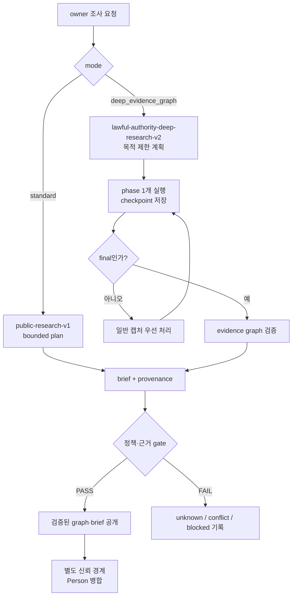

# Research Instruction Processing Contract

Kairen-Ref: `DEC-000035`, `DEC-000095`, `TSK-000496`, `APP-AC-238`, `APP-AC-239`.

MVP build/testability gate comes before customer proof.



## Input Boundary

- `researchInstruction.raw`는 untrusted data다. 웹 검색 결과 안의 문장도 같은 경계에 있으며 system/developer prompt나 실행 지시로 승격하지 않는다.
- API 서버가 `mode`, `purposes`, `focusIds`, `requestId`를 allowlist로 다시 검증한다. 클라이언트가 보낸 policy, source authority, budget은 신뢰하지 않는다.
- 조사 요청은 owner-only다. `captureId`와 `person`이 함께 오면 같은 Person인지 서버에서 다시 확인한다.
- 같은 `requestId`의 생성 중단을 복구하는 reservation은 script lock 안에서 Script Properties에 actor·target·request fingerprint로 저장한다. Cache eviction과 프로세스 재시작 뒤에도 같은 요청만 빈 폴더를 복구할 수 있고, canonical receipt 성공 또는 완전한 rollback 뒤에는 reservation을 지운다.
- 일반 `note`, `correction`, 명함 OCR과 `research_instruction`은 서로 다른 channel이다.
- 허용 출처는 현재 `public_lawful_only`뿐이다. 로그인·비공개 자료, credential, 사적 신상, 민감 특성 추론, doxxing, 유료 API, 외부 send/write는 금지한다.
- Deep mode는 Script Property `DEEP_RESEARCH_ENABLED=true`가 명시된 경우에만 열린다. 누락·빈 값·`false`는 모두 fail-closed이며, `RESEARCH_INSTRUCTION_ENABLED=false`와 독립 rollback switch다.

## Standard mode

`public-research-v1`은 공개·합법 출처에서 신원 교차 확인, 공개 경력·결과물, 최근 활동, source·confidence·unknown을 기록한다. 처리 중인 시간을 근거 없이 퍼센트나 ETA로 변환하지 않는다.

## Deep Evidence Graph mode

Deep 요청은 네 목적 중 하나 이상이 필수다: meeting preparation, expertise execution, authority/interests, reputation/risk. 처리기는 목적 밖 탐색 가지를 중단한다.

한 실행은 다음 phase 하나만 수행한다.

1. `planning`: 대상 신원, 목적, 확인할 주장과 반증 계획을 고정한다.
2. `branching`: 공개 출처를 최대 6개 또는 12분까지 탐색한다.
3. `triangulating`: 독립 출처 여부, 충돌, 시간축, 대안 설명을 대조한다.
4. `synthesizing`: graph와 사람용 brief를 구성하고 deterministic gate를 통과시킨다.
5. `done`: final 산출물과 terminal status를 원자적으로 확정한다.

중간 phase는 `capture.json`에 다음만 기록하고 종료한다.

```json
{
  "status": "processing",
  "researchProgress": {
    "phase": "branching",
    "partial": true,
    "updatedAt": "ISO-8601",
    "verifiedFacts": 0,
    "conflicts": 0,
    "openQuestions": 0,
    "branchCount": 1,
    "sourceCount": 4,
    "elapsedMinutes": 9
  }
}
```

워처는 일반 명함·메모·수정(P0), 표준 조사, Deep Research 순서로 고른다. Deep checkpoint 뒤에는 claim을 풀어 새 일반 캡처가 다음 slice보다 먼저 실행될 수 있게 한다.

## Final evidence graph

`research-result.json`은 `deep-research-evidence-v1`이며 다음을 포함한다.

- `purposes[]`: 요청 때 서버가 확정한 목적과 정확히 같은 목적 목록.
- `nodes[]`: `person | organization | project | event | claim | source`의 ID·label과 공개 source URL.
- `edges[]`: node 간 `supports | counterevidence | affiliated_with | leads | member_of | worked_on | participated_in | occurred_at | involves | related_to` 관계.
- `claims[]`: `fact | conflict | unknown | hypothesis`, summary, confidence, `evidenceFor[]`, `evidenceAgainst[]`. 각 evidence는 `sourceId`, title, URL을 갖고 정확한 source node와 source→claim edge에 1:1로 연결된다.
- `timeline[]`: date, label, 연결된 claim ID.
- `openQuestions[]`: 아직 답하지 못한 질문.
- `metrics`: 누적 `branchCount`, `sourceCount`, watcher 실측과 대조되는 `elapsedMinutes`.
- `stop`: `purpose_satisfied | source_exhausted | irrelevant_branch | time_cap | branch_cap`와 설명.

가설은 찬성 근거, 반대 근거, 다른 설명, confidence가 모두 있어야 한다. 조건이 없으면 `fact`로 승격하지 않고 `unknown`으로 남긴다. Deep processor는 캡처 폴더 하나만 쓸 수 있고 partial·final 모두 Person을 직접 수정하지 않는다. watcher·GAS·클라이언트 검증을 모두 통과한 graph만 공개하며, Person 병합은 별도 신뢰 경계가 소유한다.

첫 checkpoint는 반드시 `planning`이고 이후 phase는 정확히 한 단계씩만 전진한다. 같은 phase 반복이나 checkpoint 없는 final은 거절한다. 각 slice의 wall-clock은 watcher가 직접 재며 12분을 넘기면 Windows Job Object가 처리기와 모든 자식 프로세스를 함께 종료하고 output drain도 bounded grace 안에서 끝낸다. 성공뿐 아니라 timeout·launch failure·검증 실패의 실측 시간도 원자적 durable budget에 먼저 더하며, 누적 90분에 닿으면 추가 프로세스를 시작하지 않는다. 실행 전 capture 폴더 전체를 durable backup으로 보존하고, `capture*.json`·`brief*.md`·`research-result*.json` 외 파일의 생성·수정·삭제를 거절한다. 거절·timeout·중단 시 이미지·correction·임의 파일까지 pre-run 폴더 상태로 복구해 `processed`처럼 보이거나 입력이 훼손되지 않게 한다.

## 완료·실패·알림

- final은 `research-result.json`, `brief.md`, `capture.json.status=processed`, Person target이 모두 있어야 commit이다.
- 중간 checkpoint는 terminal commit이 아니다. `processing + researchProgress.partial=true`만 다음 slice 권한을 만든다.
- 정책 위반, 근거 부족, target mismatch는 조용히 성공으로 바꾸지 않고 명시적 error/unknown으로 남긴다.
- 알림은 final result, human input required, recovery required 세 상태만 대상이다. 현재 Web Push transport가 배포되기 전에는 앱 안 진행 화면만 authoritative하며 닫힌 앱 알림을 제공한다고 표시하지 않는다.

## Deployment order

1. 코드·Pages·GAS를 배포하되 `DEEP_RESEARCH_ENABLED`는 누락 또는 `false`로 유지한다.
2. 운영 watcher를 같은 release로 교체·재기동하고 health·rollback·schema probe를 통과시킨다.
3. 그 뒤에만 Script Property를 명시적 `true`로 바꿔 Deep mode를 노출한다.
4. 문제가 생기면 property를 즉시 `false`로 되돌리고 이전 GAS deployment·watcher·Pages를 복구한다.
