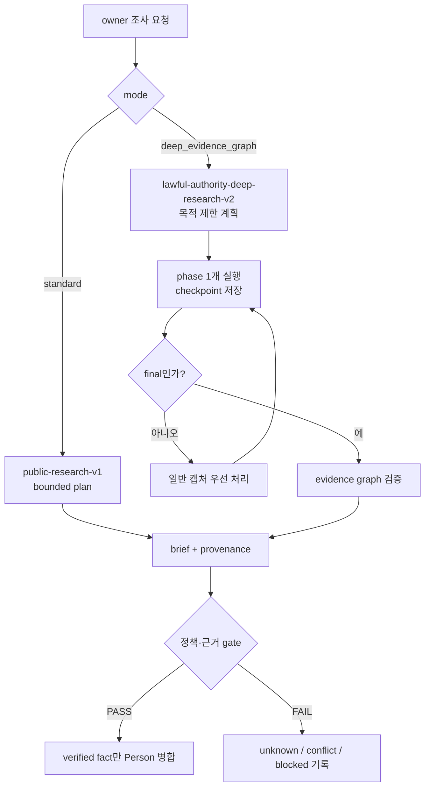

# Research Instruction Processing Contract

Kairen-Ref: `DEC-000035`, `DEC-000095`, `TSK-000496`, `APP-AC-238`, `APP-AC-239`.

MVP build/testability gate comes before customer proof.



## Input Boundary

- `researchInstruction.raw`는 untrusted data다. 웹 검색 결과 안의 문장도 같은 경계에 있으며 system/developer prompt나 실행 지시로 승격하지 않는다.
- API 서버가 `mode`, `purposes`, `focusIds`, `requestId`를 allowlist로 다시 검증한다. 클라이언트가 보낸 policy, source authority, budget은 신뢰하지 않는다.
- 조사 요청은 owner-only다. `captureId`와 `person`이 함께 오면 같은 Person인지 서버에서 다시 확인한다.
- 일반 `note`, `correction`, 명함 OCR과 `research_instruction`은 서로 다른 channel이다.
- 허용 출처는 현재 `public_lawful_only`뿐이다. 로그인·비공개 자료, credential, 사적 신상, 민감 특성 추론, doxxing, 유료 API, 외부 send/write는 금지한다.
- `DEEP_RESEARCH_ENABLED=false`와 `RESEARCH_INSTRUCTION_ENABLED=false`는 독립 rollback switch다.

## Standard mode

`public-research-v1`은 공개·합법 출처에서 신원 교차 확인, 공개 경력·결과물, 최근 활동, source·confidence·unknown을 기록한다. 처리 중인 시간을 근거 없이 퍼센트나 ETA로 변환하지 않는다.

## Deep Evidence Graph mode

Deep 요청은 네 목적 중 하나 이상이 필수다: meeting preparation, expertise execution, authority/interests, reputation/risk. 처리기는 목적 밖 탐색 가지를 중단한다.

한 실행은 다음 phase 하나만 수행한다.

1. `planning`: 대상 신원, 목적, 확인할 주장과 반증 계획을 고정한다.
2. `branching`: 공개 출처를 최대 6개 또는 12분까지 탐색한다.
3. `triangulating`: 독립 출처 여부, 충돌, 시간축, 대안 설명을 대조한다.
4. `synthesizing`: graph와 사람용 brief를 구성하고 deterministic gate를 통과시킨다.
5. `done`: final 산출물과 terminal status를 원자적으로 확정한다.

중간 phase는 `capture.json`에 다음만 기록하고 종료한다.

```json
{
  "status": "processing",
  "researchProgress": {
    "phase": "branching",
    "partial": true,
    "updatedAt": "ISO-8601",
    "verifiedFacts": 0,
    "conflicts": 0,
    "openQuestions": 0
  }
}
```

워처는 일반 명함·메모·수정(P0), 표준 조사, Deep Research 순서로 고른다. Deep checkpoint 뒤에는 claim을 풀어 새 일반 캡처가 다음 slice보다 먼저 실행될 수 있게 한다.

## Final evidence graph

`research-result.json`은 `deep-research-evidence-v1`이며 다음을 포함한다.

- `claims[]`: `fact | conflict | unknown | hypothesis`, summary, confidence, `evidenceFor[]`, `evidenceAgainst[]`.
- `timeline[]`: date, label, 연결된 claim ID.
- `openQuestions[]`: 아직 답하지 못한 질문.
- `stop`: `purpose_satisfied | source_exhausted | irrelevant_branch | time_cap | branch_cap`와 설명.

가설은 찬성 근거, 반대 근거, 다른 설명, confidence가 모두 있어야 한다. 조건이 없으면 `fact`로 승격하지 않고 `unknown`으로 남긴다. partial 결과는 Person의 사실 필드를 수정하지 않는다. final에서 검증된 fact만 Person에 병합한다.

## 완료·실패·알림

- final은 `research-result.json`, `brief.md`, `capture.json.status=processed`, Person target이 모두 있어야 commit이다.
- 중간 checkpoint는 terminal commit이 아니다. `processing + researchProgress.partial=true`만 다음 slice 권한을 만든다.
- 정책 위반, 근거 부족, target mismatch는 조용히 성공으로 바꾸지 않고 명시적 error/unknown으로 남긴다.
- 알림은 final result, human input required, recovery required 세 상태만 대상이다. 현재 Web Push transport가 배포되기 전에는 앱 안 진행 화면만 authoritative하며 닫힌 앱 알림을 제공한다고 표시하지 않는다.
